## 计算机毕业设计Python深度学习房价预测 房源可视化 房源爬虫 二手房可视化 二手房爬虫 递归决策树模型 机器学习 深度学习 大数据毕业设计

## 要求
### 源码有偿！一套(论文 PPT 源码+sql脚本+教程)

### 
### 加好友前帮忙start一下，并备注github有偿纯python房价预测
### 我的QQ号是2827724252或者798059319或者 1679232425或者微信:bysj2023nb 或bysj1688

# 

### 加qq好友说明（被部分 网友整得心力交瘁）：
    1.加好友务必按照格式备注
    2.避免浪费各自的时间！
    3.当“客服”不容易，repo 主是体面人，不爆粗，性格好，文明人。
	
## 介绍
房地产是促进我国经济持续增长的基础性、主导性产业，二手房市场是我国房地产市场不可或缺的组成部分。由于二手房的特殊性，目前市场上实时监测二手房市场房价涨幅的情况较少，影响二手房价的因素错综复杂，价格并非呈传统的线性变化。 本项目利用Python实现某一城市二手房相关信息的爬取，并对爬取的原始数据进行数据清洗，存储到数据库中，通过 flask 搭建后台，分析影响二手房房价的各类因素，并构建递归决策树模型，实现房价预测建模。

## 演示视频
https://www.bilibili.com/video/BV1CGycYfE8W/

https://www.bilibili.com/video/BV1qtycYUEwj/

## 演示截图

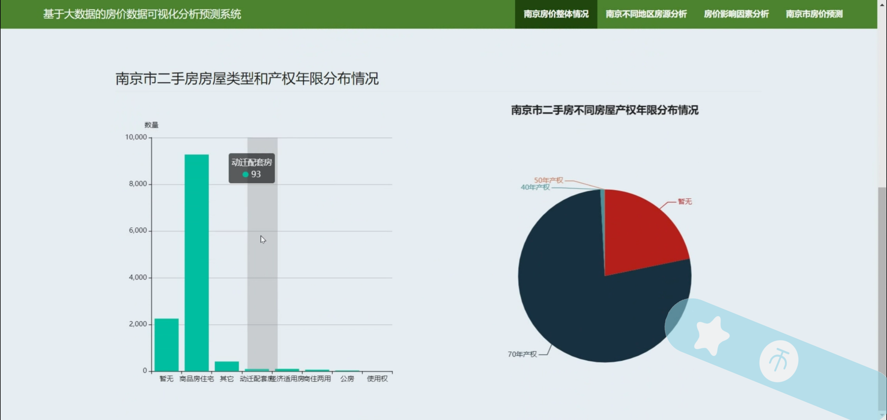
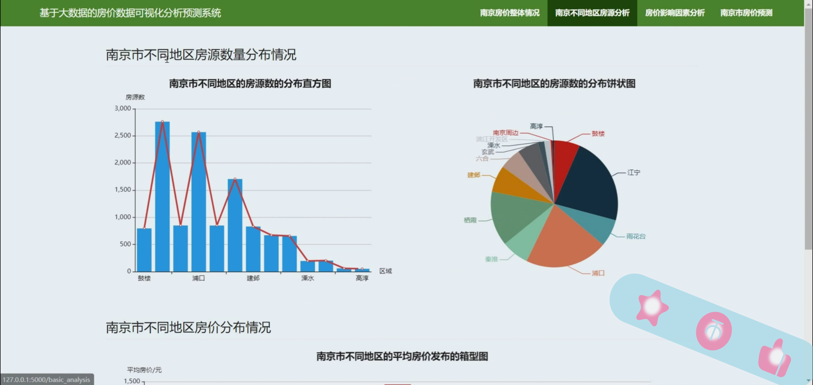
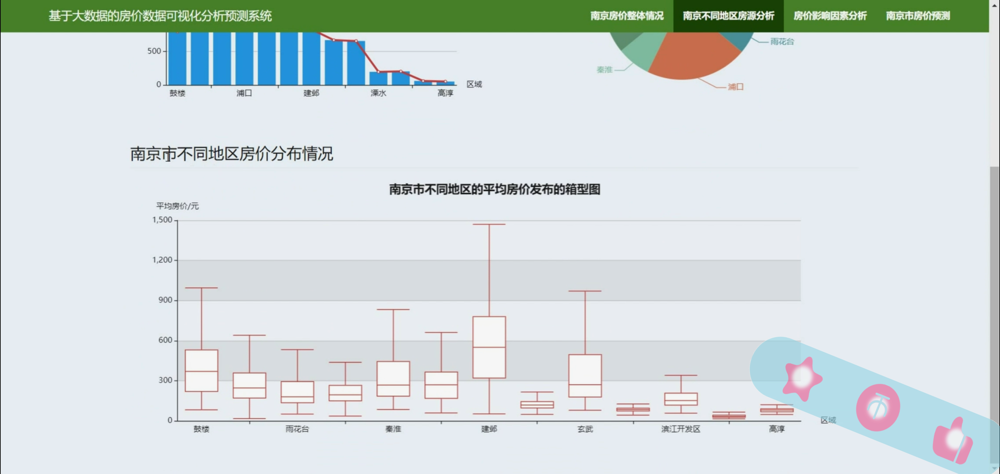
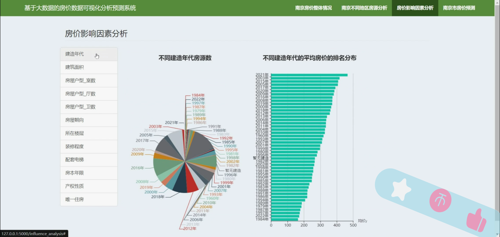
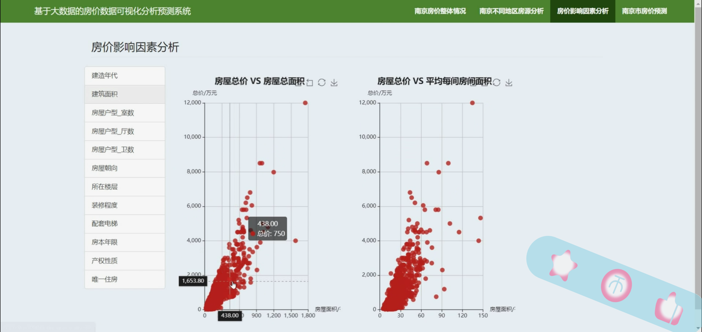
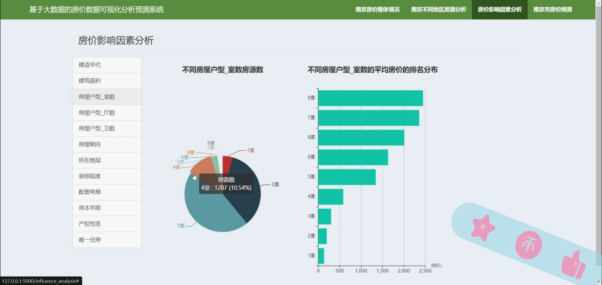
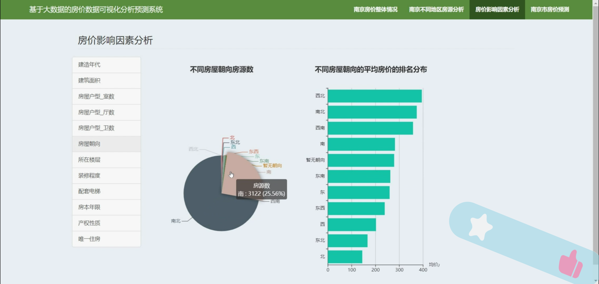
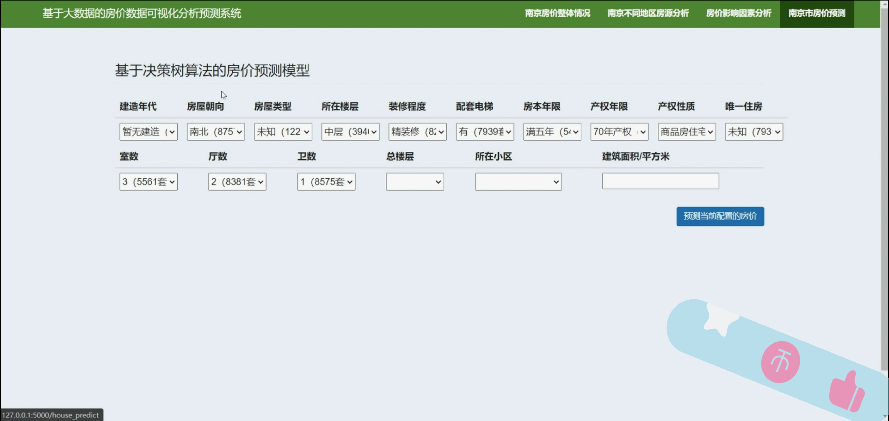
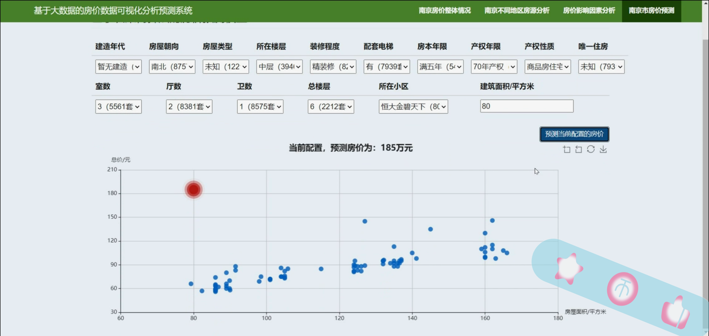
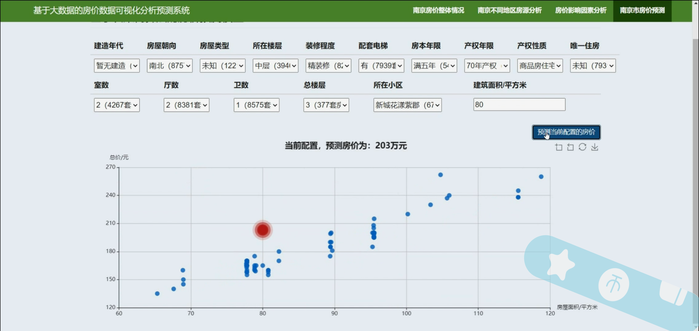
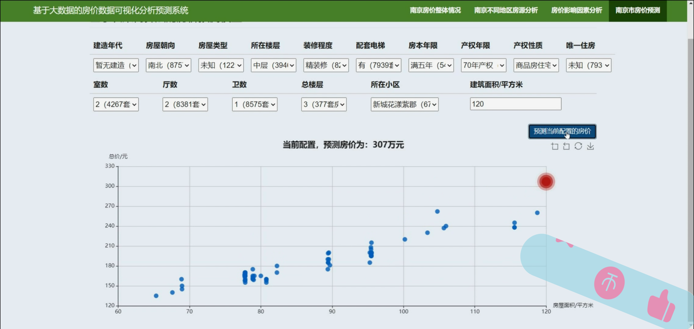

